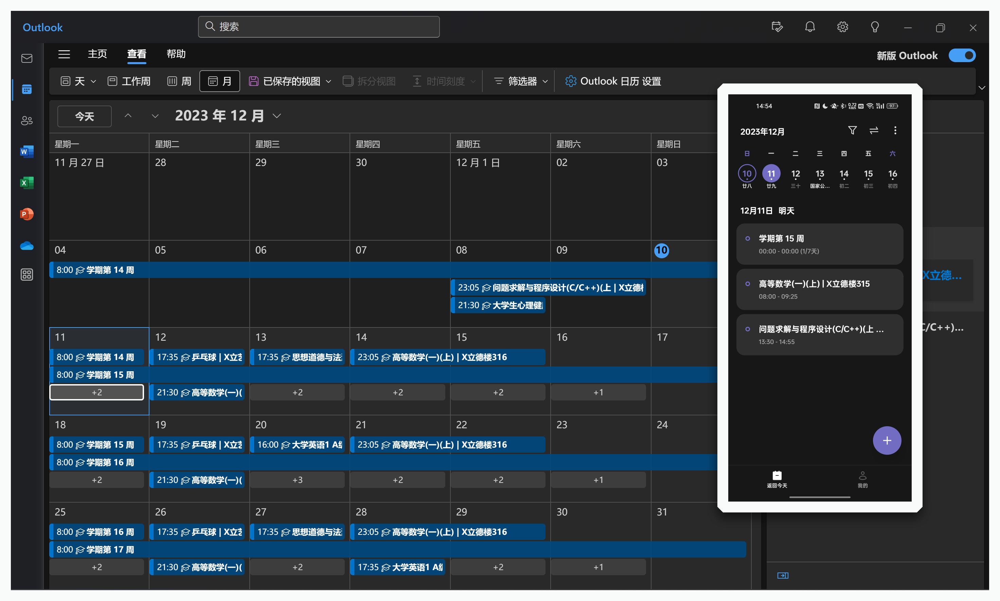
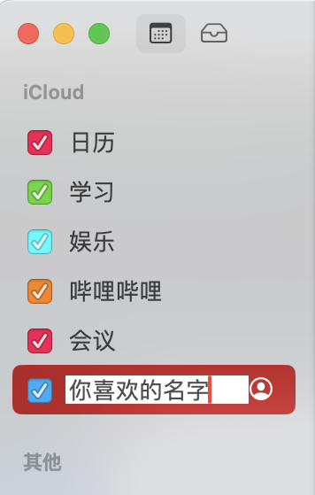
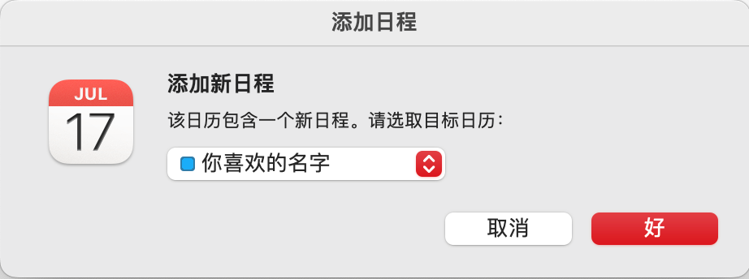

# CCZU-iCal-rs

快速将常州大学课表转换为 ICalendar 文件导入日历

## 这是什么 🤔

你是否在寻找一个更好用、更干净的课程表，而流行的`WakeUp`、`超级课程表`等或多或少都有些不足

这个项目就是为了帮你把课表转化为 ics 文件而存在的，尝试一下用日历看课表吧！

这个项目是命令行应用，如果您需要更方便地在各个平台上使用，请查看 [CCZU-OSSA/cczu-helper](https://github.com/CCZU-OSSA/cczu-helper)

### 特点 ✨

- 在 Windows、macOS、iOS、Android、Windows Phone 等系统，以及各大邮箱服务都有着强大的原生支持
- 免去第三方课表应用的流氓推广、无用社交功能，以及保持后台提醒推送时的耗电情况，实现功能的轻量化
- 得益于云同步的功能，只需一个设备导入课表，其他关联设备都可同步显示

小贴士：现在几乎所有手机的左侧副屏都有日历提醒功能哦，真的巨方便

## 截图展示 🥰

### 导入 Windows Outlook(新)/手机(ColorOS) 日历展示 📅



### 导入 macOS/iPhone 的日历展示 📅

待补充

## 使用 🔥

那么如何使用呢？

## 下载 📦

前往 [此处](https://github.com/CCZU-OSSA/CCZU-iCal-rs/releases/latest) 根据你的系统下载对应的版本，通常下载对应系统的可执行文件并运行即可，Windows后缀一般为 `.exe`

带 `-lib` 的是动态链接库，用于二次开发调用，如无必要无需下载

## 运行 🚀

为确保能成功连上 CCZU 的服务器，推荐在连接校园网的情况下运行，运行时最好关闭代理

### MacOS 需要注意的 ⚠️

参考 [在 Mac 上的“终端”中使文件可执行](https://support.apple.com/zh-cn/guide/terminal/apdd100908f-06b3-4e63-8a87-32e71241bab4/mac)

使用`chmod 755 文件名称`后即可在终端中运行

_PS: Linux 也需要`chmod`，不过应该都会罢（_

## 生成的文件位置 🗺️

MacOS 导出课表到`Downloads/` 或者说 `下载/` 文件夹下，其他系统默认会生成在本程序根目录文件夹下

## 将 ICalendar(.ics) 文件导入日历 📄

### macOS 教程 🍎

多图预警 ⚠️

<details>

打开日历 app，右键侧边栏新建日历，取一个你喜欢的名字(新建日历便于日后批量管理)



点开刚刚生成的 class.ics 文件，导入就完成啦



</details>


### iPhone 教程 🍎

1. 在电脑上成功生成了class.ics文件后，登录你的任意一个邮箱账号，通过邮件附件的形式将ics文件发送给自己 (~~原地tp~~)

2. 在 iPhone 上打开系统自带的邮件 app，在收件箱里点击邮件里的ics附件，在弹出的新页面中点击右上角蓝色🟦的**添加全部**按键

3. 添加全部后完善你的信息, (选择添加到哪个日历📅) 然后就可以在日历中查看课程表了

附上Apple官网的[教程](https://support.apple.com/zh-cn/guide/iphone/ipha0d932e96/ios) (~~和没讲一样~~) 

## 仍有疑问？ 😣

不会使用可以加群问问

QQ GROUP `947560153`

### 反馈 BUG/提出建议 🐛

[Issues](https://github.com/CCZU-OSSA/CCZU-iCal-rs/issues)

## 应用程序二进制接口 🔃

DLL 里提供了多个接口，可以使用 C 的 ABI 标准调用

### 函数描述 💬


#### generate_ics

函数会直接返回课程表文本

```C
const char* generate_ics(const char *username, const char *password, const char *firestweekdate, const char *reminder);
```

#### generate_ics_json

函数会返回一个json文本，包含2个键值对

 - data
 - ok

如果在 `ok == true` 的情况下，data就是课程表文本，否则data为错误信息

```C
const char* generate_ics_json(const char *username, const char *password, const char *firestweekdate, const char *reminder);
```

### 参数说明 📄

| 参数名称       | 参数说明                           |
| -------------- | ---------------------------------- |
| username       | 用户名/学号                        |
| password       | 密码,默认为身份证后六位            |
| firestweekdate | 学期第一周的第一天, 格式`YYYYMMDD` |
| reminder       | 课前提醒 (解析失败默认 15min)      |

### 调用示例 📄

```python
from ctypes import CDLL, c_char_p

cs = lambda ps: c_char_p(ps.encode("utf-8"))

rdl = CDLL("./cczu_ical_rs.dll")
rdl.generate_ics.restype = c_char_p
data = rdl.generate_ics(cs("学号"), cs("密码"), cs("20230904"), cs("15"))
with open("class.ics", "w", encoding="utf-8") as f:
    f.write(data.decode("utf-8").replace("\r\n", "\n"))
```

## 自定义课表时间 ⚙️

参考 `src\classtime.config.json` 进行配置

将你的课表配置文件命名为 `custom.config.json`保存在程序同一目录下即可

## 致谢 🎉

- [Hogan-TR/CCZU-iCal](https://github.com/Hogan-TR/CCZU-iCal)
  - 最初的 CCZU-iCal 由这位大佬编写 ~~地狱代码~~
- [Student-WangYL/CCZU-iCal](https://github.com/Student-WangYL/CCZU-iCal)
  - 在第一版的基础上进行修改
