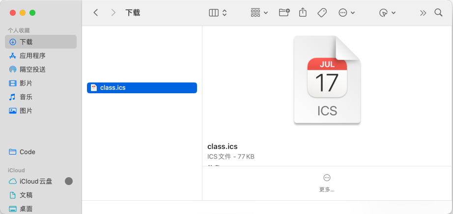
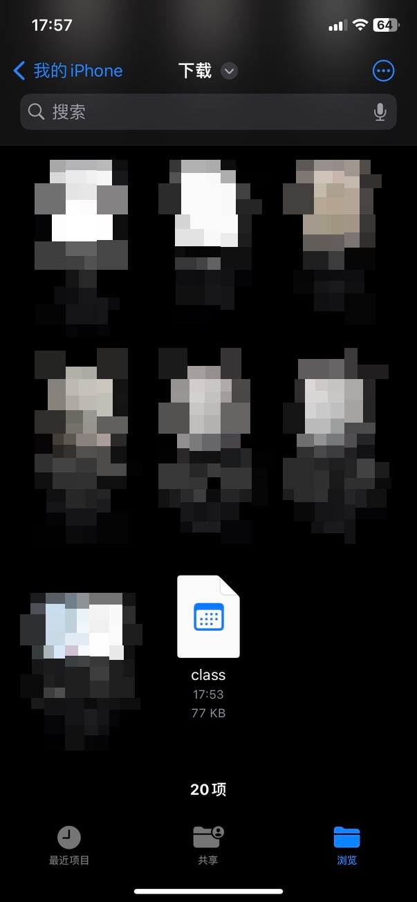
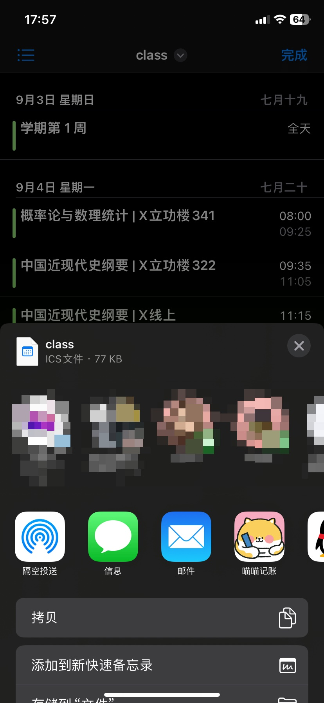
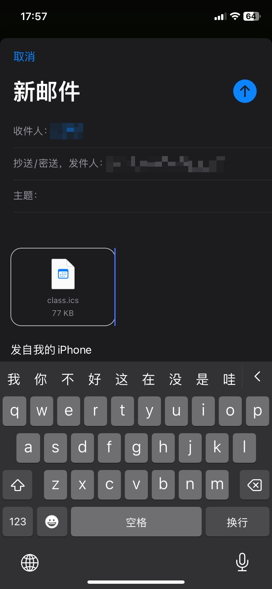
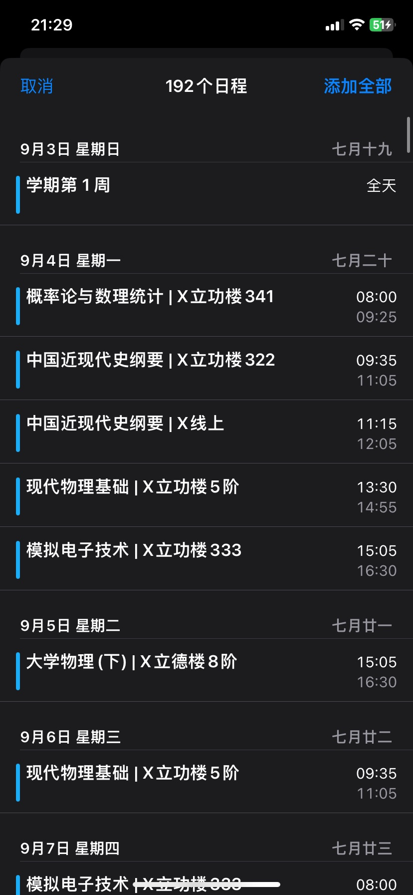
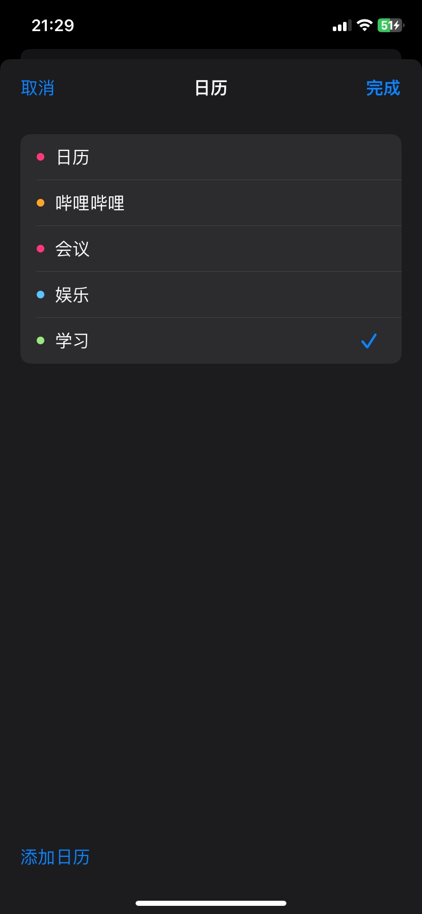

# CCZU-iCal-rs

快速将常州大学课表转换为 ICalendar 文件导入日历

## 这是什么 🤔

你是否在寻找一个更好用、更干净的课程表，而流行的`WakeUp`、`超级课程表`等或多或少都有些不足

这个项目就是为了帮你把课表转化为 ics 文件而存在的，尝试一下用日历看课表吧！

### 特点 ✨

- 在 Windows、macOS、iOS、Android、Windows Phone 等系统，以及各大邮箱服务都有着强大的原生支持
- 免去第三方课表应用的流氓推广、无用社交功能，以及保持后台提醒推送时的耗电情况，实现功能的轻量化
- 得益于云同步的功能，只需一个设备导入课表，其他关联设备都可同步显示

小贴士：现在几乎所有手机的左侧副屏都有日历提醒功能哦，真的巨方便

## 截图 🥰

### 导入 Windows Outlook(新)/手机(ColorOS) 日历


### 导入 macOS/iPhone 日历 📅

## macOS 教程

首先打开日历 app，右键侧边栏新建日历，取一个你喜欢的名字(新建日历便于日后批量管理)


点开刚刚生成的 class.ics 文件



导入就完成啦


## iPhone 教程

手机有点小麻烦(~~果子 🐶 史一样的操作逻辑~~)
如何把从QQ下载的文件存到 文件app 不用我交吧,就是手机自带的那个
找到你保存的class.ics文件



长按分享,分享到邮件



然后把文件发送到自己的另一个邮箱



然后在收件箱里点击邮件里的ics附件



添加全部然后完善你的信息(添加到哪个日历📅)



附上Apple官网的[教程](~~和没讲一样~~) (https://support.apple.com/zh-cn/guide/iphone/ipha0d932e96/ios)

## 使用 🔥

那么如何使用呢？

### 下载 📦

前往 [此处](https://github.com/CCZU-OSSA/CCZU-iCal-rs/releases/latest) 根据你的系统下载对应的版本

带 `-lib` 的是动态链接库，用于二次开发调用，如无必要无需下载

### MacOS 需要注意的 ⚠️

参考 [在 Mac 上的“终端”中使文件可执行](https://support.apple.com/zh-cn/guide/terminal/apdd100908f-06b3-4e63-8a87-32e71241bab4/mac)

使用`chmod 755 文件名称`后即可在终端中运行

_PS: Linux 也需要`chmod`，不过应该都会罢（_

### 生成的文件位置 🗺️

MacOS 导出课表到`Downloads/`文件夹下，其他系统默认在程序文件夹下

### 将 ICalendar 文件导入日历 📄

用日历打开 ics 文件即可，不会使用可以加群问问

QQ GROUP `947560153`

### 反馈 BUG/提出建议 🐛

[Issues](https://github.com/CCZU-OSSA/CCZU-iCal-rs/issues)

## 应用程序二进制接口 🔃

DLL 里提供了一个接口`generate_ics`，可以使用 C 的 ABI 标准调用

### 函数描述 💬

```C
const char* generate_ics(const char *username, const char *password, const char *firestweekdate, const char *reminder);
```

### 参数说明 📄

| 参数名称       | 参数说明                     |
| -------------- | ---------------------------- |
| username       | 用户名/学号                  |
| password       | 密码                         |
| firestweekdate | 学期第一周的第一天           |
| reminder       | 课前提醒(解析失败默认 15min) |

### 调用示例 📄

```python
from ctypes import CDLL, c_char_p

cs = lambda ps: c_char_p(ps.encode("utf-8"))

rdl = CDLL("./cczuical.dll")
rdl.generate_ics.restype = c_char_p
data = rdl.generate_ics(cs("学号"), cs("密码"), cs("20230904"), cs("15"))
with open("class.ics", "w", encoding="utf-8") as f:
    f.write(data.decode("utf-8").replace("\r\n", "\n"))
```

## 自定义课表时间 ⚙️

参考 `src\classtime.config.json` 进行配置

将你的课表配置文件命名为 `custom.config.json`保存在程序同一目录下即可

## 致谢 🎉

- [Hogan-TR/CCZU-iCal](https://github.com/Hogan-TR/CCZU-iCal)
  - 最初的 CCZU-iCal 由这位大佬编写 ~~地狱代码~~
- [Student-WangYL/CCZU-iCal](https://github.com/Student-WangYL/CCZU-iCal)
  - 在第一版的基础上进行修改
